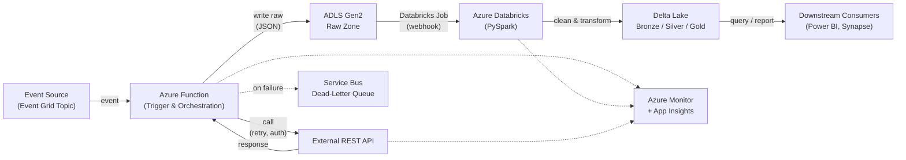

```mermaid
flowchart LR
    %% ---------- Nodes ----------
    E["Event Source<br/>(Event Grid Topic)"]
    F["Azure Function<br/>(Trigger &amp; Orchestration)"]
    API["External REST API"]
    RAW["ADLS Gen2<br/>Raw Zone"]
    DBX["Azure Databricks<br/>(PySpark)"]
    DL["Delta Lake<br/>Bronze / Silver / Gold"]
    CONS["Downstream Consumers<br/>(Power BI, Synapse)"]
    MON["Azure Monitor<br/>+ App Insights"]
    DLQ["Service Bus<br/>Dead-Letter Queue"]

    %% ---------- Edges ----------
    E -->|event| F
    F -->|"call\n(retry, auth)"| API
    API -->|response| F
    F -->|"write raw\n(JSON)"| RAW
    F -.->|on failure| DLQ
    RAW -->|"Databricks Job\n(webhook)"| DBX
    DBX -->|"clean & transform"| DL
    DL -->|"query / report"| CONS

    %% ---------- Monitoring ----------
    F -.-> MON
    DBX -.-> MON
    API -.-> MON
```
