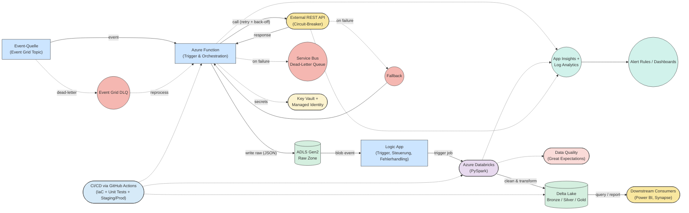

# Event-gesteuerte API-Triggerung: Architektur Skizze

### Legende Farbcodierung

| Farbe        | Kategorie                   |
|--------------|-----------------------------|
| 🟦 Blau | Event / Steuerung           | 
| 🟨 Gelb | Externe Systeme             |
| 🟩 Grün | Speicherung                 |
| 🟪 Lila | Verarbeitung                |
| 🟦 Türkis | Monitoring & Alerting       |
| 🟧 Beige | Security / Governance       | 
| 🟥 Rot | Fehlerpfade / Fallback / DLQ| 
| 🟦 Hellblau | CI / CD                     |
| 🟥 Rosa | Data Quality                |

### Legende Formen

| Form                         | Bedeutung                           |
|------------------------------|--------------------------------------|
| Rechteck                  | Standardprozess / Funktion / Logik   |
| Abgerundetes Rechteck     | Externe Systeme / Dienste            |
| Zylinder                  | Datenspeicher / Datenhaltung         |
| Ellipse                  | Sonderrolle: Monitoring, Fehler, DLQ |
